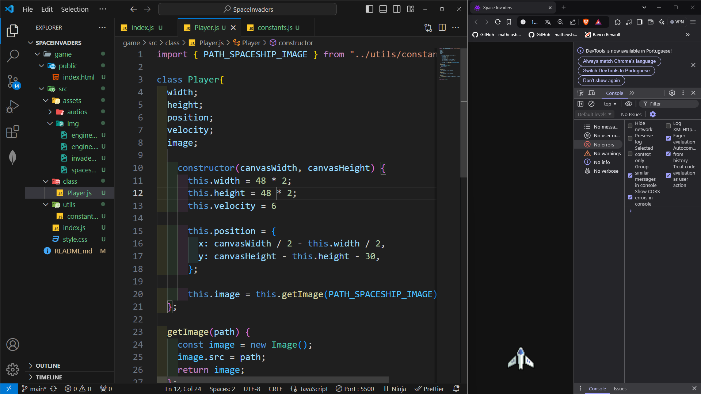

# SpaceInvaders

Olá, tudo bem?
Eu me chamo Feliph, e se você está aqui no meu perfil observando este repositório, tenho algo para compartilhar com você.

Este projeto/repositório tem como objetivo:

- Treinar e aprimorar minhas habilidades em JavaScript, HTML e CSS;

- Desenvolver minha proficiência no uso da ferramenta Canva;

- Enriquecer meu futuro portfólio com beleza, capricho e criatividade;

- Tornar o aprendizado uma prática mais prazerosa e eficiente.

Como primeiro passo da jornada criamos um RoadMap para guiar o desenvolvimento das atividades

Junto a isso é indicado que sejam feitos alguns commits e push com o desenvolver da atividade:

O primeiro Commit sera realizado apos:

- estruturação do projeto
- criação do mecanismo de movimentação da nave
- estilização da nave

como demonstrado na imagem a seguir:

- acima podemos notar que não existem mensagens de erro no console
- todo os arquivos estão distribuidos em suas respectivas pastas
- e a nave ja se encontra operante, funcional e respeitando os limites da pagina
